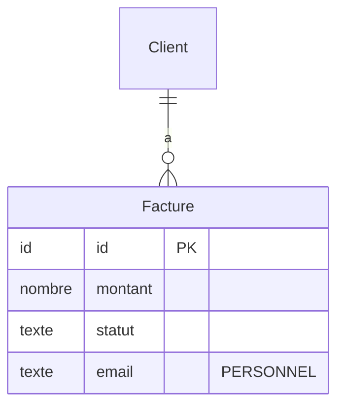

# Schémas des structures de données

Chaque structure de données nouvelle ou modifiée par la PR reçoit un **schéma**. Un schéma montre en un coup d'œil ce que le texte mettrait 10 lignes à dire : quels champs, quels liens, ce qui est nouveau, ce qui est sensible.

## Ce qui reçoit un schéma

- **Données stockées** : nouvelles, ou modifiées (champ ajouté, supprimé, changé de type).
- **Données échangées** qui décrivent une donnée métier : une commande, un client, une facture. Pas les structures purement techniques internes.
- **Listes de valeurs** qui portent un état métier (brouillon, envoyée, payée).

Pas de schéma pour une structure qui n'a pas changé : elle n'apparaît que comme **voisine**, par son nom seul, si une structure nouvelle s'y relie.

Les schémas décrivent la donnée, pas la technologie : noms de champs et types simples (texte, nombre, date, booléen, identifiant, liste), quel que soit l'outil utilisé par le projet.

## Format dans le terminal : des boîtes en texte

Le rapport s'affiche dans un terminal, qui ne dessine pas les diagrammes. Le schéma est fait en caractères de boîte, dans un bloc de code pour garder l'alignement.

```
┌─ Facture ──────────────── NOUVEAU ─┐
│ id            identifiant  clé     │
│ client        → Client             │
│ montant       nombre               │
│ statut        → StatutFacture      │
│ email         texte    PERSONNEL   │
│ creee_le      date                 │
└────────────────────────────────────┘
          │ plusieurs factures
          ▼ pour 1 client
┌─ Client ───────────────── EXISTANT ┐
│ + adresse     texte    PERSONNEL   │
└────────────────────────────────────┘
```

Règles :
- **Une boîte par structure.** Le nom en haut, le statut à droite : `NOUVEAU`, `MODIFIÉ`, `EXISTANT`.
- **3 colonnes au plus par ligne** : nom du champ, type, repère. Les colonnes sont alignées.
- **Repères**, toujours les mêmes mots : `clé`, `→ Structure` (lien vers une autre structure), `unique`, `PERSONNEL` (donnée personnelle), `SECRET` (mot de passe, jeton, clé), `optionnel`.
- Pour une structure **modifiée**, n'afficher que les champs changés, précédés de `+` (ajouté), `-` (supprimé) ou `~` (type ou contrainte changé).
- Les **liens** entre boîtes sont des flèches verticales, avec en clair le sens de la relation (« plusieurs factures pour 1 client »). Pas de notation savante.
- **Aucun émoji**, ni dans les boîtes ni autour.
- Au-delà de **12 champs**, garder les plus importants et finir par `… 5 autres champs`.
- Au-delà de **4 boîtes**, faire plusieurs schémas, un par groupe de structures liées.

Sous chaque schéma, 1 à 3 puces au plus : à quoi sert la structure, et ce qu'il faut remarquer. Les problèmes eux-mêmes vont dans les parties Sécurité ou Code, avec un renvoi.

## Listes de valeurs

```
┌─ StatutFacture ─────────── NOUVEAU ─┐
│ brouillon | envoyée | payée         │
└─────────────────────────────────────┘
```

## Format pour GitHub : Mermaid

Si l'utilisateur demande de publier le rapport en commentaire sur la PR, remplace chaque boîte par un diagramme Mermaid, que GitHub dessine : `erDiagram` pour les données liées entre elles, `classDiagram` pour les structures échangées.



Dans le terminal, ne jamais livrer de Mermaid brut : il ne se lit pas.

## Sources

- [GitHub Docs — Creating diagrams (Mermaid)](https://docs.github.com/en/get-started/writing-on-github/working-with-advanced-formatting/creating-diagrams)
- [Mermaid — Entity Relationship Diagrams](https://mermaid.js.org/syntax/entityRelationshipDiagram.html)
- [Mermaid — Class diagrams](https://mermaid.js.org/syntax/classDiagram.html)
